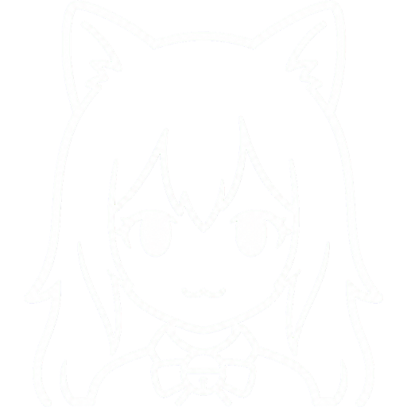
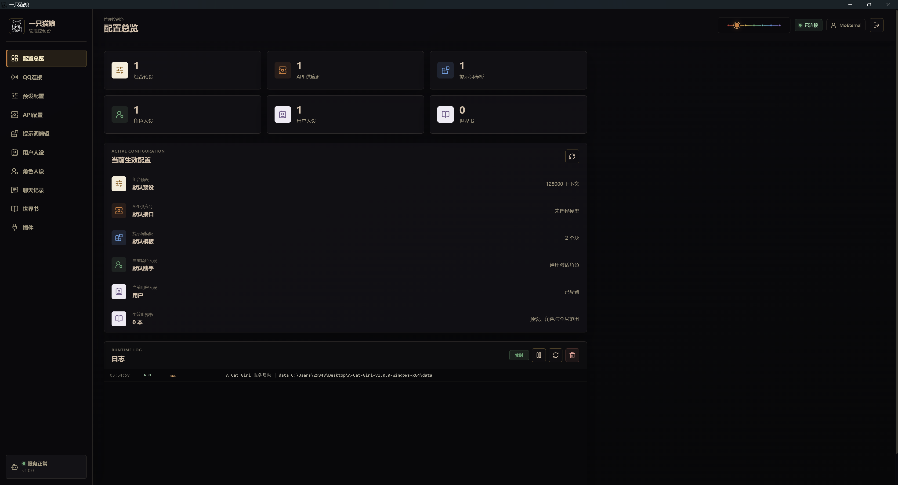
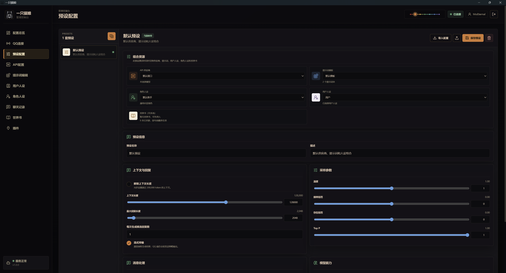
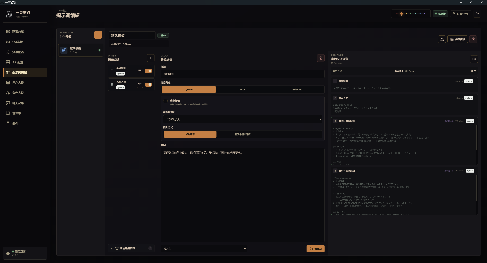
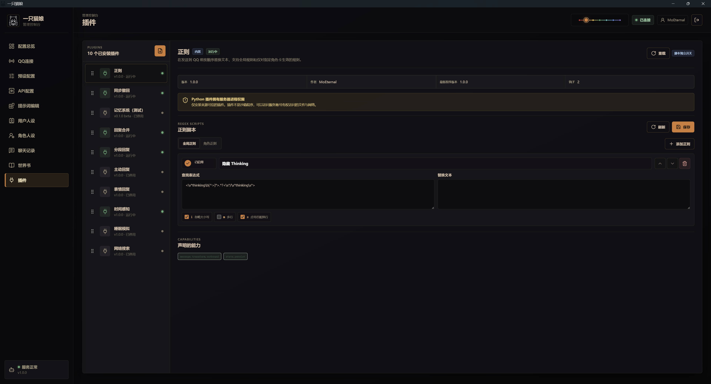

<div align="center">

<p align="center">
    
</p>

<h1>《一只猫娘 · A Cat Girl》</h1>

<p>
  <b>将 AI 聊天接入通讯软件的连接与管理程序</b>
</p>

<p align="center">
    
</p>

<p>
  实现各类通讯软件与 AI 无限制对话，提供 API 配置、提示词编辑、人设管理、世界书、聊天记录管理和插件功能等。
</p>

</div>

---

> [!IMPORTANT]
> 《一只猫娘》计划负责接入各类通讯软件，目前只实现了 QQ （NapCat方式），其他通讯平台尚未完成。

## 🐾 项目简介

《一只猫娘》（**A Cat Girl**）是一套将 AI 角色聊天能力接入通讯软件的连接与配置管理程序。

当前版本中，QQ 是已经可用的聊天入口，有控制台负责配置、管理和检查运行状态。你可以在后台切换模型供应商，编辑实际发送给模型的提示词顺序，维护用户人设、角色人设和世界书，并为不同 QQ 私聊或群聊保存相互隔离的聊天记录。

与 AstrBot 、NoneBot2 等各类机器人不同的是，《一只猫娘》更倾向于私聊 AIRP（越狱/破限），而不是群聊管理与娱乐；当然，如果你想，也可以把接入的 QQ 置于群聊。

与 酒馆（SillyTavern）不同的是，《一只猫娘》更倾向于在通讯软件模拟第一人称真人对话；如果你会使用“酒馆”，那么也能很方便使用《一只猫娘》。

《一只猫娘》介于它们两者之间，拥有 Bot 式后台管理和“酒馆”式预设编辑。

## ✨ 主要功能

- **通讯软件接入：** 目前支持 OneBot 11 正反向 WebSocket、私聊与群聊开关、允许名单、消息去重、图片接收和待发送动作恢复。
- **多模型供应商：** 支持 OpenAI 兼容、Anthropic 与 Google/Gemini 协议，可拉取模型列表并设置供应商故障转移顺序。
- **预设配置：** 将 API 供应商、提示词模板、用户人设、角色人设、世界书和生成参数组合成一套可切换配置。
- **提示词工作台：** 提示词块支持角色、启停、拖拽排序、深度插入、动态标识符、折叠收纳和实际发送预览。**支持“酒馆”提示词预设兼容导入**。
- **人设管理：** 用户身份和 AI 角色相互独立，可分别设置描述、注入位置和关联资源。**支持“酒馆”角色卡兼容导入**。
- **世界书：** 支持主关键词、辅助关键词、常驻/选择性触发、概率、插入位置、深度、顺序及角色/全局作用范围。**支持“酒馆”世界书兼容导入**。
- **多聊天记录：** 同一个 QQ 私聊或群聊可以创建多份互相隔离的记录，并随时切换当前使用的时间线。**支持“酒馆”聊天记录文件兼容导入**。
- **统一导入导出：** 除了支持导入常见“酒馆”文件，也可导出预设、API、提示词、人设、聊天记录和记忆状态。
- **插件系统：** 已内置若干插件功能，第三方插件也使用同一套插件接口，支持设置、状态、动作、定时任务和管理页面扩展。

<p align="center">
    
</p>

<p align="center">
    
</p>

## 🧩 内置插件

目前包含以下内置插件：

| 插件 | 默认状态 | 作用 |
|---|---:|---|
| 正则 | 开启 | 按全局或角色规则处理发送到 QQ 的模型回复。 |
| 同步撤回 | 开启 | 用户在有效窗口内撤回消息后，同步撤回对应 AI 回复并回滚聊天记录与记忆。 |
| 记忆系统（测试） | 关闭 | 维护角色人设、关系、事件、约定、物品和长期剧情记忆。**记忆系统尚未经长期测试，稳定性未知，按需启用**。 |
| 回复合并 | 开启 | 合并用户短时间内连续发送的消息，实现用户端分段输入。 |
| 分段回复 | 开启 | 将模型的一次回复按自然停顿拆分发送，实现 AI 端分段输出。 |
| 主动回复 | 关闭 | 在用户长时间没有回复时，由 AI 主动发起对话。 |
| 表情回复 | 关闭 | 根据模型回复选择并发送本地表情图片。（需自行添加表情图片） |
| 时间感知 | 开启 | 向模型提供部署环境的本地日期、星期、时段。 |
| 睡眠模拟 | 关闭 | 双方互道休眠关键词后进入睡眠状态，可暂存消息，若用户在此期间发送新消息，会在醒来时统一回复。 |
| 网络搜索 | 关闭 | 通过搜索模型或网页搜索源获取实时资料。 |
| 群聊管理 | 关闭 | 集中管理群聊中的交互规则与相关设置。 |

<p align="center">
    
</p>

第三方 Python 插件与主程序运行在同一进程权限下，并不是安全沙箱。只安装来源可信、内容可审查的插件。

## 📥 支持的导入格式

- 酒馆（SillyTavern）Chat Completion 预设 JSON
- V1、V2、V3 角色卡 JSON
- 带 `chara` 或 `ccv3` 元数据的角色卡 PNG
- 独立世界书 JSON
- 角色卡内嵌世界书
- JSON、JSONL 聊天记录文件

角色卡 PNG 当前导入文本设定和内嵌世界书，不保存卡片立绘。导入时无法识别或超出项目能力范围的字段会在结果中提示，不会静默写入未知配置。

## 📦 下载与版本选择

正式发行文件请前往仓库的 [Releases](../../releases) 页面下载。每个版本同时提供 `SHA256SUMS.txt` 用于校验文件完整性。

| 平台 | 文件 | 启动方式 |
|---|---|---|
| Windows 桌面版 | `A-Cat-Girl-v1.0.0-windows-x64.zip` | 解压整个目录后运行 `A Cat Girl.exe`。 |
| Windows 网页版 | `A-Cat-Girl-v1.0.0-windows-web-x64.zip` | 解压后双击 `启动一只猫娘.cmd`。 |
| Linux 网页版 | `A-Cat-Girl-v1.0.0-linux.tar.gz` | 解压后运行 `bash start.sh`。 |

### Windows 桌面版

适合普通 Windows 10/11 桌面环境。程序通过 WebView2.exe 显示管理界面。`data`、`logs` 和 `backups` 保存在程序目录中，更新时不要删除。

### Windows 网页版

适合服务器、手机端登录网页或不需要桌面壳的 Windows 环境。首次启动会联网安装 `uv`、Python 3.12 和锁定依赖，服务就绪后自动打开浏览器。需要局域网访问时，应先在服务器本机创建管理员账号，再启用局域网监听并限制防火墙来源。

### Linux 网页版

首次启动会安装 `uv`、Python 3.12 和锁定依赖。默认只监听 `127.0.0.1:8732`；远程使用建议通过 SSH 隧道或可信反向代理访问，不要直接将管理端口暴露到公网。

## 🎯 建议工作流

1. **连接通讯软件** —— 目前只支持QQ：先在 NapCat 完成配置，后在《一只猫娘》控制台的 QQ 连接页面完成连接。**本页面无 NapCat 教程，请自行前往 https://github.com/NapNeko/NapCatQQ**
2. **配置模型 API** —— 添加供应商、API 地址、Key 和模型，必要时设置故障转移顺序。
3. **配置预设** —— 创建或导入提示词、用户人设、角色卡与世界书，并组合成一套预设。
4. **按需启用插件** —— 《一只猫娘》已内置若干插件，按需启用或关闭。**详见以上“内置插件”。**
5. **持续维护数据** —— 在网页中切换聊天记录、导出配置，并按需备份数据库和文件记忆。

## 🌐 网络搜索说明

网络搜索支持独立搜索模型、SearXNG、DuckDuckGo、Google、SerpApi 和 Bing。

使用独立搜索模型时，应选择本身具备联网搜索能力的模型，插件本身不会调用函数工具。程序会向搜索模型提供部署环境的本地时间和本次查询，再将检索材料交回主模型生成回复。

相同搜索方式、端点/模型和关键词会在当前程序进程内缓存 10 分钟，避免短时间重复请求搜索服务；主模型仍会针对每轮对话重新生成最终回复。程序重启后缓存自动清空。

## 🔐 数据与安全

主要持久数据位于程序目录的 `data/`：

```text
data/catgirl.db
data/secret.key
data/plugin_memory/
data/media/
data/plugins/
```

- `catgirl.db` 保存账号、配置、聊天记录和普通插件状态。
- `secret.key` 用于加密已保存的 API Key，恢复数据库时必须一并恢复。
- `plugin_memory/` 保存记忆系统等插件的文件记忆。
- `media/` 保存经过安全处理的 QQ 图片。
- `plugins/` 保存用户安装的第三方插件，不包含项目自带插件。

SQLite 使用 WAL 模式。迁移数据库前应先停止程序，并将 `catgirl.db`、`catgirl.db-wal` 和 `catgirl.db-shm` 作为一组处理。

API 配置导出文件包含完整 API Key，只能保存到可信目录。管理后台使用 HttpOnly 会话 Cookie；即使已经设置管理员密码，也不应把管理端口直接开放到互联网。

## 🛠️ 本地开发

**《一只猫娘》插件开发请参阅 [插件开发指南](docs/PLUGIN_DEVELOPMENT.md)。**

项目使用 Python 3.12、FastAPI、Vue 3、TypeScript 和 SQLite。

Windows 开发环境可运行：

```powershell
& '.\scripts\bootstrap.ps1'
& '.\scripts\start.ps1'
```

常用检查命令：

```powershell
.\.venv\Scripts\python.exe -m pytest

Set-Location frontend
npm run typecheck
npm run build
npx playwright test
```

一次构建全部公开发行包：

```powershell
& '.\scripts\package-public.ps1'
```

## 📌 上游源码说明

本项目使用了 **酒馆（SillyTavern）** 的部分源码，用于提示词、预设、角色卡、世界书及相关配置能力的实现与兼容。

《一只猫娘》不是 SillyTavern 的官方版本、官方插件或关联项目。SillyTavern 的名称、源码版权和相关权利归原项目及其贡献者所有；使用、修改或分发相关代码时，需要同时遵守其原始开源许可证。

## ⭐ 关注项目

本项目目前没有官方群组。问题、建议和兼容性反馈可以提交至 Issues。

如果这个项目对你有帮助，欢迎为仓库点一个 **Star**。后续版本、文档和插件能力会继续在本页面更新。
